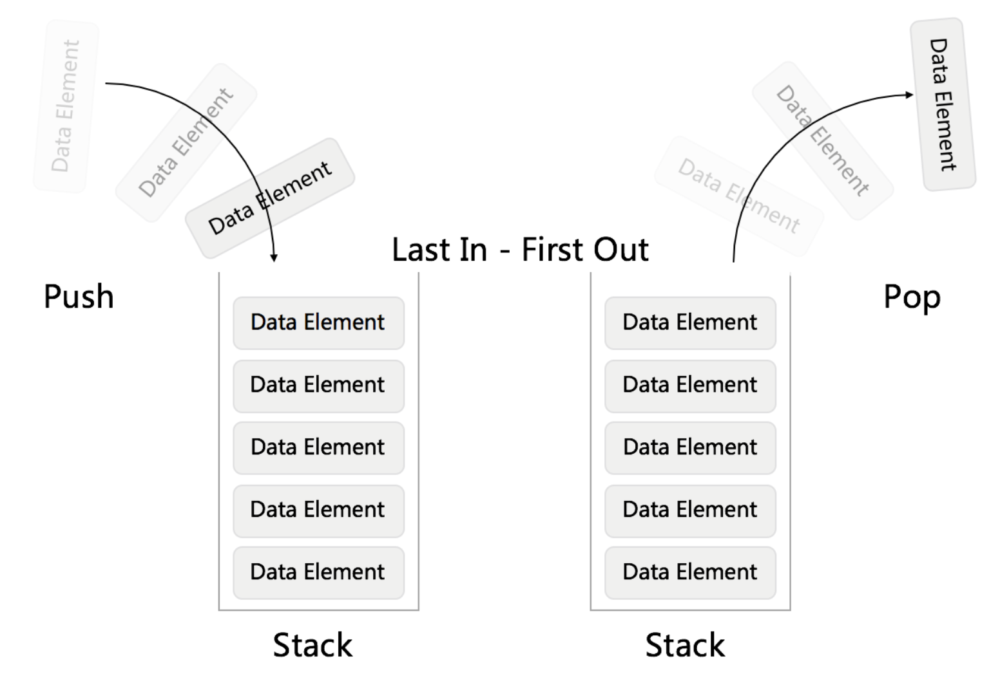

[232.用栈实现队列](https://leetcode-cn.com/problems/implement-queue-using-stacks/comments/)

栈：



> Java
> 入栈：push
> 出栈：pop
> 栈顶元素：peek
> 判断为空：stack.isEmpty
> 定义栈： private Stack<Integer> stack = new Stack<>();

```Java
class MyQueue {
    private Stack<Integer> inStack;//输入栈
    private Stack<Integer> outStack;//输出栈

    /** Initialize your data structure here. */
    public MyQueue() {
        inStack = new Stack<>();
        outStack = new Stack<>();
    }
    
    /** Push element x to the back of queue. */
    public void push(int x) {
        inStack.push(x);
    }
    
    /** Removes the element from in front of queue and returns that element. */
    public int pop() {
        if(outStack.isEmpty()) {
            while(!inStack.isEmpty()) {
                outStack.push(inStack.pop());
            }
        }
        return outStack.pop();
    }
    
    /** Get the front element. */
    public int peek() {
        if(outStack.isEmpty()) {
            while(!inStack.isEmpty()) {
                outStack.push(inStack.pop());
            }
        }
        return outStack.peek();
    }
    
    /** Returns whether the queue is empty. */
    public boolean empty() {
        return inStack.isEmpty() && outStack.isEmpty();
    }
}

/**
 * Your MyQueue object will be instantiated and called as such:
 * MyQueue obj = new MyQueue();
 * obj.push(x);
 * int param_2 = obj.pop();
 * int param_3 = obj.peek();
 * boolean param_4 = obj.empty();
 */
```

> Python
> 入栈：append
> 出栈：pop
> 栈顶元素：stack[-1]
> 判断为空：len(stack) == 0
> 定义栈：self.instack = []


```python
class MyQueue(object):

    def __init__(self):
        """
        Initialize your data structure here.
        """
        self.instack = []
        self.outstack = []

    def push(self, x):
        """
        Push element x to the back of queue.
        :type x: int
        :rtype: None
        """
        self.instack.append(x)

    def pop(self):
        """
        Removes the element from in front of queue and returns that element.
        :rtype: int
        """
        if len(self.outstack) == 0:
            while self.instack:
                self.outstack.append(self.instack.pop())
        return self.outstack.pop()

    def peek(self):
        """
        Get the front element.
        :rtype: int
        """
        if len(self.outstack) == 0:
            while self.instack:
                self.outstack.append(self.instack.pop())
        return self.outstack[-1]
    def empty(self):
        """
        Returns whether the queue is empty.
        :rtype: bool
        """
        return len(self.instack) == 0 and len(self.outstack) == 0


# Your MyQueue object will be instantiated and called as such:
# obj = MyQueue()
# obj.push(x)
# param_2 = obj.pop()
# param_3 = obj.peek()
# param_4 = obj.empty() 
```

