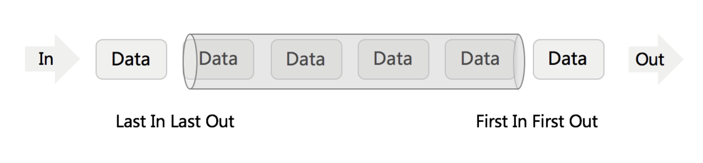

[225、用队列实现栈](https://leetcode-cn.com/problems/implement-stack-using-queues/comments/)

队列



>Java
>
>入队：offer
>
>出对：poll
>
>队顶元素：peek
>
>队列是否为空：isEmpty
>
>队列定义： private Queue<Integer> a = new LinkedList<>();

```Java
class MyStack {
    private Queue<Integer> a;//输入队列
    private Queue<Integer> b;//输出队列
    
    public MyStack() {
        a = new LinkedList<>();
        b = new LinkedList<>();
    }
    
    public void push(int x) {
        a.offer(x);
        // 将b队列中元素全部转给a队列
        while(!b.isEmpty())
            a.offer(b.poll());
        // 交换a和b,使得a队列没有在push()的时候始终为空队列
        Queue temp = a;
        a = b;
        b = temp;
    }
    
    public int pop() {
        return b.poll();
    }
   
    public int top() {
        return b.peek();
    }
    
    public boolean empty() {
        return b.isEmpty();
    }
}
```

>Python
>
>入队：append
>
>出对：popleft
>
>队顶元素：queue[0]
>
>队列是否为空：len(self.queue) == 0
>
>队列定义： self.q1 = deque()

```python
class MyStack:

    def __init__(self):
        """
        Initialize your data structure here.
        """
        self.q1 = deque()
        self.q2 = deque()


    def push(self, x: int) -> None:
        """
        Push element x onto stack.
        """
        self.q1.append(x)
        while self.q2:
            self.q1.append(self.q2.popleft())
        self.q1, self.q2 = self.q2, self.q1


    def pop(self) -> int:
        """
        Removes the element on top of the stack and returns that element.
        """
        return self.q2.popleft()

    def top(self) -> int:
        """
        Get the top element.
        """
        return self.q2[0]


    def empty(self) -> bool:
        """
        Returns whether the stack is empty.
        """
        return len(self.q2) == 0


# Your MyStack object will be instantiated and called as such:
# obj = MyStack()
# obj.push(x)
# param_2 = obj.pop()
# param_3 = obj.top()
# param_4 = obj.empty()
```

