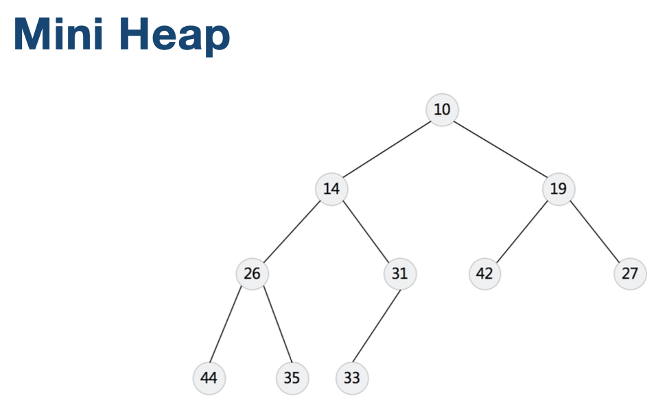
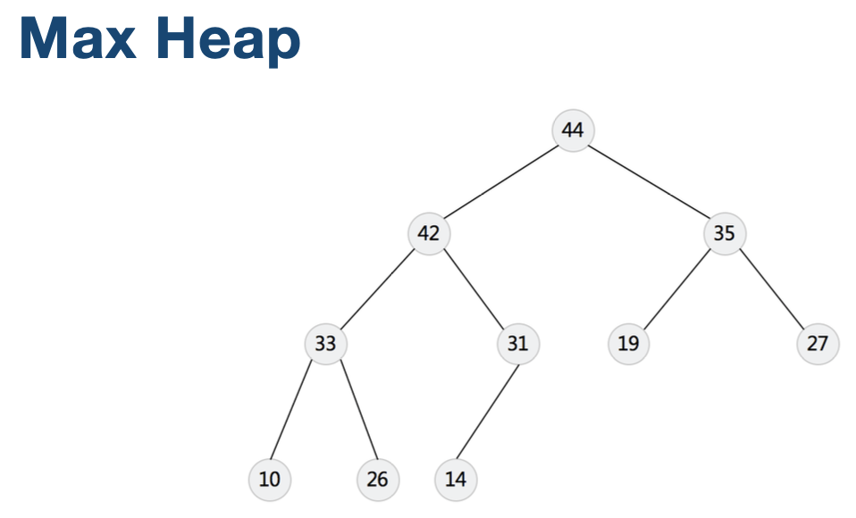
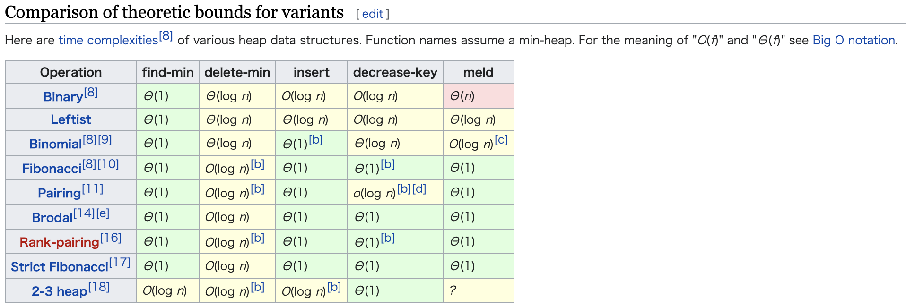

# 优先队列实现方式 - Heap堆

1. Heap (Binary, Binomial, Fibonacci)






[Heap Wiki](https://en.wikipedia.org/wiki/Heap_(data_structure))



[703、 数据流中的第K大元素](https://leetcode-cn.com/problems/kth-largest-element-in-a-stream/)

>PriorityQueue是一个小顶堆，最小元素在最前面，且堆已经为有序状态
>
>在初始化的过程中，找到数组中前k个大的元素，然后保存到PriorityQueue中
>
>每执行add方法，会与PriorityQueue中最小的元素对比，调整PriorityQueue，保证队列中的的k个数为最大，且最小的排第一个，通过调用peek获取第k个大的元素

```java
class KthLargest {

    final PriorityQueue<Integer> q;
    final int k;
    public KthLargest(int k, int[] nums) {
        this.k = k;
        q = new PriorityQueue<>(k);
        for(int n : nums) {
            add(n);
        }
    }
   
    public int add(int val) {
        if(q.size() < k) {
            q.offer(val);
        }else if(q.peek() < val) {
            q.poll();
            q.offer(val);
        }
        return q.peek();
    }
}

/**
 * Your KthLargest object will be instantiated and called as such:
 * KthLargest obj = new KthLargest(k, nums);
 * int param_1 = obj.add(val);
 */
```


