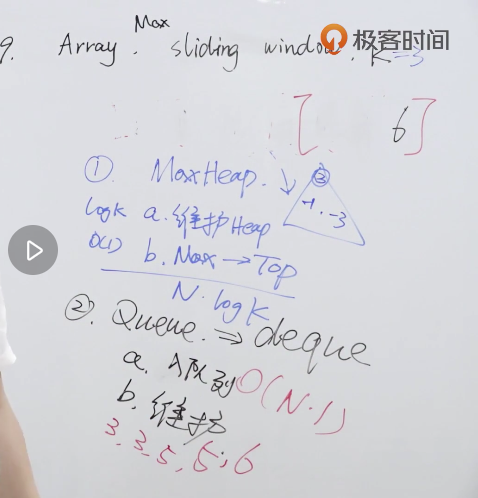

#### [239. 滑动窗口最大值](https://leetcode-cn.com/problems/sliding-window-maximum/)

给定一个数组 nums，有一个大小为 k 的滑动窗口从数组的最左侧移动到数组的最右侧。你只可以看到在滑动窗口内的 k 个数字。滑动窗口每次只向右移动一位。

返回滑动窗口中的最大值。



使用双端队列处理

>1. 验证nums数组是否有效
>2. 维护数组，保证window左边的下标数值最大
>3. window数组中存储的是元素下标，因为window长度固定，所以当window中存储满元素，在下一次移动时，就要把左侧的元素移出队列
>4. 将队列右侧的元素与将要新加的元素做比较，如果小于新增元素，则移出，直到window数组为空，或者队列左侧元素大于新增元素，最后在window队列中加入新增元素的下标
>5. 如果移动坐标大于k，则将window左侧下标的值添加到res队列中

```python
	class Solution:
    def maxSlidingWindow(self, nums, k):
        if not nums: return []
        window, res = [], []
        for i, x in enumerate(nums):
            if i >= k and i - window[0] >= k :
                window.pop(0)
            while window and nums[window[-1]] <= x:
                window.pop()
            window.append(i)
            if i + 1 >= k:
                res.append(nums[window[0]])
        return res
```

>Java中的双端队列 LinkedList
>
>弹出对首元素：poll
>
>弹出队尾元素：pollLast
>
>获取对首元素：peek
>
>获取队尾元素：peekLast
>
>队尾添加元素：offer，addLast

```java
class Solution {
    public int[] maxSlidingWindow(int[] nums, int k) {
        if(nums == null || nums.length < k) return nums;
        LinkedList<Integer> window = new LinkedList<>();
        int[] result = new int[nums.length - k + 1];

        for(int i = 0; i < nums.length; i++) {
            if(i >= k && i - window.peek() >= k) {
                window.poll();
            }
            while( !window.isEmpty() && nums[window.peekLast()] <= nums[i]) {
                window.pollLast();
            }
            window.offer(i);
            if(i+1 >= k) {
                result[i-k+1] = nums[window.peek()];
            }
        }
        return result;
    }
}
```

